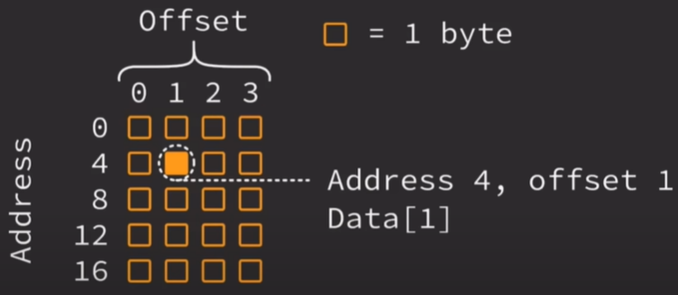

# Intermediate memory
## Basic memory refresh
- Memory is stored using binary
    - Each bit is a 0 or 1
- A computer is optimized for bytes
    - 8 bits = 1 byte
- Fully contiguous
    - Each byte is stored next to each other
    - Each byte has an address
    - Each address is 1 byte apart

## Addresses
- All data in memory has an address
    - USed to locate data
    - Always the same - only data changes
- Usually don't utilize address directly
    - Variables handle most of the work

## Offsets
- Items can be located at an address using an "offset"
    - Offsets begin at 0
- Represent the number of bytes away from the original address
    - 0 = same address
    - 1 = 1 byte away
    - 2 = 2 bytes away
    - etc.
    - Normally deal with indexes instead and the compiler handles the offsets

