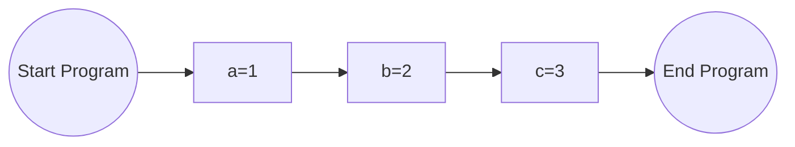
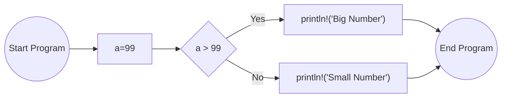
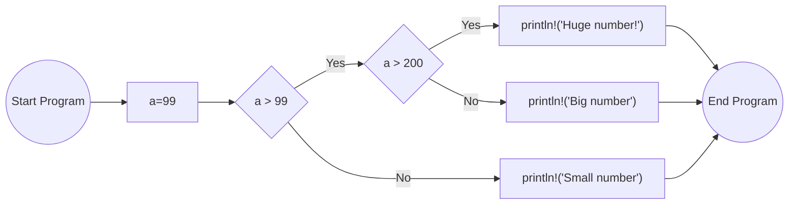
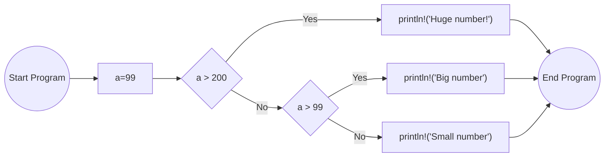

# Control flow using if

## Execution flow
- code executed line-by-line
- Actions are performed & control flow may change
- Specific conditions can change control flow:
    - "if"
    - "else"
    - "else if"

## Example flow

### Example 1

```rust
let a = 1;
let b = 2;
let c = 3;
```
The flow will be:



### Example 2


``` rust
let a = 99;
if a > 99 {
    println!("Big Number");
} else {
    println!("Small Number");
}
```
The flow will be:


### Example 3

``` rust
let a = 99;
if a > 99 {
    if a > 200 {
        println!("Huge number!");
    } else {
        println!("Big number");
    }
} else {
    println!("Small number");
}
```
The flow will be:



### Example 4

``` rust
let a = 99;
if a > 200 {
    println!("Huge number!");
} else if a > 99 {
    println!("Big number");
} else {
    println!("Small number");
}
```

The flow will be:

