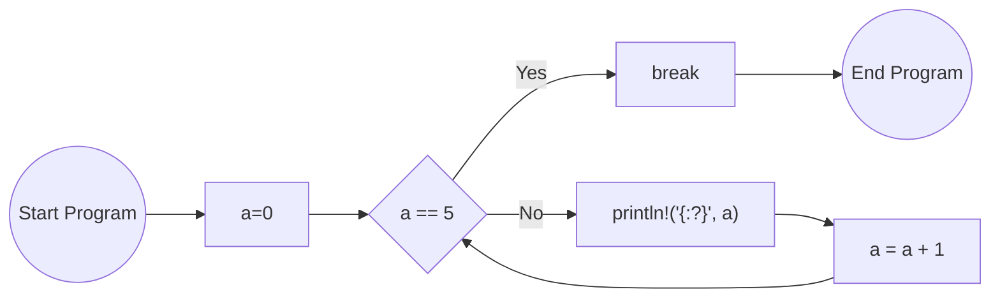
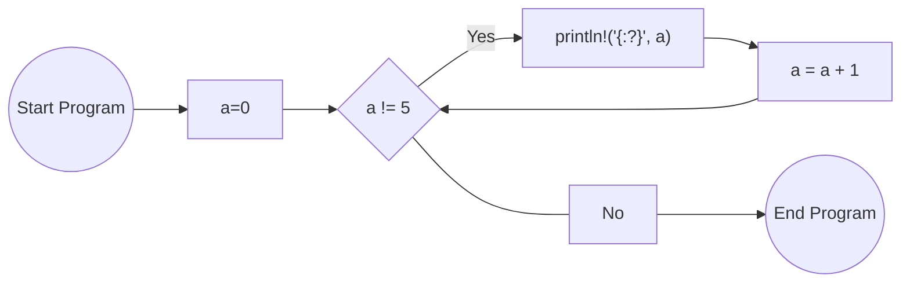

# Repetition using loops

- Called "looping" or "iteration"
- Multiple types of loops:
    a. "loop" - infinite loop (or until it is broken)
    b. "while" - loop while a condition is true

## Loop

```rust
let mut a = 0;
loop {
    if a == 5 {
        break;
    }
    println!("{:?}", a);
    a = a + 1;
}
```
The program flow will be


## While

```rust
let mut a = 0;
while a != 5 {
    println!("{:?}", a);
    a = a + 1;
}
```

The program flow will be



